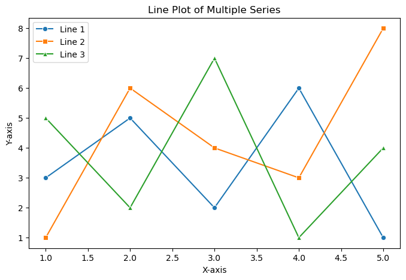

# EXNO-6-DS-DATA VISUALIZATION USING SEABORN LIBRARY

# Aim:
  To Perform Data Visualization using seaborn python library for the given datas.

# EXPLANATION:
Data visualization is the graphical representation of information and data. By using visual elements like charts, graphs, and maps, data visualization tools provide an accessible way to see and understand trends, outliers, and patterns in data.

# Algorithm:
STEP 1:Include the necessary Library.

STEP 2:Read the given Data.

STEP 3:Apply data visualization techniques to identify the patterns of the data.

STEP 4:Apply the various data visualization tools wherever necessary.

STEP 5:Include Necessary parameters in each functions.

# Coding and Output:
```
# -*- coding: utf-8 -*-
"""EX NO6: Data Visualization Using Seaborn"""

import pandas as pd
import numpy as np
import seaborn as sns
import matplotlib.pyplot as plt

# -------------------------------
# LINE PLOT
# -------------------------------
x = [1, 2, 3, 4, 5]
y1 = [3, 5, 2, 6, 1]
y2 = [1, 6, 4, 3, 8]
y3 = [5, 2, 7, 1, 4]

plt.figure(figsize=(8,5))
sns.lineplot(x=x, y=y1, marker='o', label='Line 1')
sns.lineplot(x=x, y=y2, marker='s', label='Line 2')
sns.lineplot(x=x, y=y3, marker='^', label='Line 3')
plt.title("Line Plot of Multiple Series")
plt.xlabel("X-axis")
plt.ylabel("Y-axis")
plt.legend()
plt.show()

# -------------------------------
# BAR PLOT USING TIPS DATASET
# -------------------------------
tips = sns.load_dataset('tips')

plt.figure(figsize=(8,5))
sns.barplot(x='day', y='total_bill', hue='sex', data=tips, palette='viridis')
plt.title("Total Bill Amount by Day Divided by Gender")
plt.xlabel("Day")
plt.ylabel("Total Bill")
plt.show()


plt.figure(figsize=(8,5))
sns.barplot(x='day', y='total_bill', hue='sex', data=tips, palette='coolwarm')
plt.title("Total Bill Amount by Day Divided by Gender")
plt.xlabel("Day")
plt.ylabel("Total Bill")
plt.show()

# -------------------------------
# BAR PLOT USING TITANIC DATASET
# -------------------------------
# Load Titanic dataset (make sure path is correct)
tit = pd.read_csv("titanic_dataset.csv")

plt.figure(figsize=(8,5))
sns.barplot(x='Embarked', y='Fare', data=tit)  # just default color
plt.title("Fare of Passenger by Embarked Town")
plt.xlabel("Embarked Town")
plt.ylabel("Fare")
plt.show()


plt.figure(figsize=(8,5))
sns.barplot(x='Embarked', y='Fare', hue='Pclass', data=tit, palette='rainbow')
plt.title("Fare of Passenger by Embarked Town, Divided by Class")
plt.xlabel("Embarked Town")
plt.ylabel("Fare")
plt.show()

# -------------------------------
# SCATTER PLOT USING TIPS DATASET
# -------------------------------
plt.figure(figsize=(8,5))
sns.scatterplot(x='total_bill', y='tip', data=tips, hue='sex', style='time', s=100)
plt.title("Scatter Plot of Total Bill vs. Tip Amount")
plt.xlabel("Total Bill")
plt.ylabel("Tip Amount")
plt.show()

# -------------------------------
# VIOLIN PLOT USING TITANIC DATASET
# -------------------------------
plt.figure(figsize=(8,5))
sns.violinplot(x='Pclass', y='Fare', hue='Sex', data=tit, split=True, palette='Set2')
plt.title("Violin Plot of Fare by Class and Gender")
plt.xlabel("Passenger Class")
plt.ylabel("Fare")
plt.show()

# -------------------------------
# HISTOGRAMS
# -------------------------------
# Random marks data
np.random.seed(0)
marks = np.random.normal(loc=70, scale=10, size=100)
plt.figure(figsize=(8,5))
sns.histplot(marks, bins=15, kde=True, color='skyblue')
plt.title("Histogram of Marks")
plt.xlabel("Marks")
plt.ylabel("Frequency")
plt.show()

# Histogram of Titanic Pclass colored by Survived
plt.figure(figsize=(8,5))
sns.histplot(data=tit, x='Pclass', hue='Survived', multiple='stack', kde=True, palette='coolwarm')
plt.title("Histogram of Passenger Class by Survival")
plt.xlabel("Passenger Class")
plt.ylabel("Count")
plt.show()

```

# OUTPUT
.png>)
.png>) 
.png>)
 .png>) 
 .png>) 
 .png>) 
 .png>) 
 .png>) 
 
# Result:
"The visualization displays the data patterns, relationships, and trends clearly, making it easier to identify correlations, outliers, and distributions."
